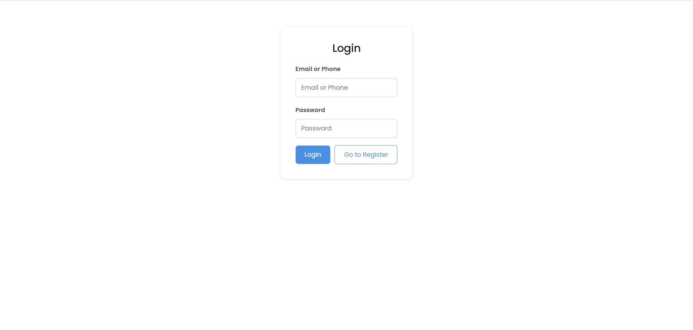
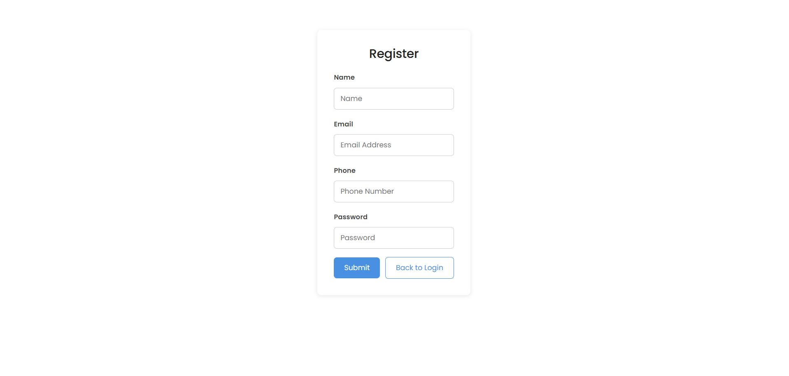
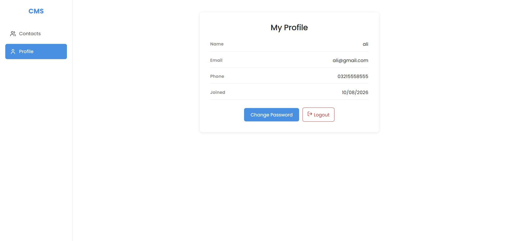
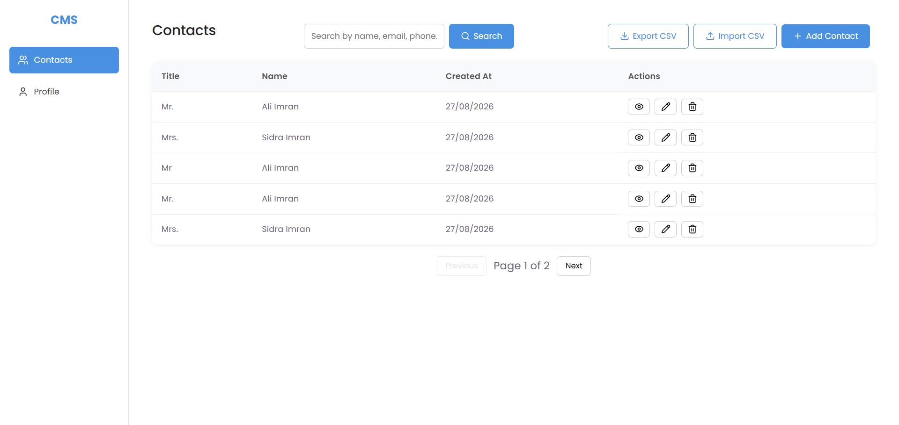

# cohort-9-java-8534-muhammad: Contacts Management System

Cohort 9 — JAVA Fullstack (JAVA+ReactJS) assignment for Muhammad Ali Imran 

A full-stack Contact Management System built with **Spring Boot** and **React**, allowing users to securely register, log in, and manage a personal contact list — including labeled, multi-value emails and phone numbers, search, pagination, and CSV import/export.

Built as part of the 10Pearls Shine Program (Java Full Stack Internship).

---

## Table of Contents

- [Features](#features)
- [Tech Stack](#tech-stack)
- [Architecture](#architecture)
- [Database Schema](#database-schema)
- [Getting Started](#getting-started)
- [API Reference](#api-reference)
- [Screenshots](#screenshots)
- [Future Enhancements](#future-enhancements)

---

## Features

### Authentication & Security
- Register with name, email, phone, and password
- Log in using **either email or phone**
- Passwords hashed with **BCrypt**
- **JWT-based authentication** delivered via a secure, **HttpOnly, SameSite cookie** (not exposed to client-side JavaScript, protecting against XSS-based token theft)
- Change password (with current-password verification)
- Logout invalidates the session cookie server-side

### Contact Management
- Create, view, update, and delete contacts
- Each contact supports **multiple labeled emails and phone numbers** (e.g. Work, Personal, Home)
- Paginated contact list
- Search contacts by first name, last name, email, or phone
- Dedicated view, edit, and delete-confirmation modals

### Import / Export
- Export all contacts to a **CSV file**, with dynamically-sized columns based on the maximum number of emails/phones across all contacts
- Import contacts from a matching CSV file, reconstructing each contact along with its labeled emails and phones

### Engineering Practices
- Centralized global exception handling with consistent error response format
- Structured logging via **Slf4j/Logback**
- **Unit and integration tests** across the repository, service, and controller layers (JUnit 5 + Mockito + H2)
- Continuous static analysis via **SonarQube**
- Toast notifications and loading states for a polished user experience

---

## Tech Stack

**Backend**
- Java 17
- Spring Boot 4.1.0
- Spring Data JPA / Hibernate
- Spring Security
- PostgreSQL 17
- JJWT (JWT generation/validation)
- Apache Commons CSV
- JUnit 5, Mockito, H2 (in-memory test DB)
- Maven

**Frontend**
- React (Vite)
- Node.js 24.11.0
- Axios
- React Router
- React Hook Form
- Lucide React (icons)

**Tooling**
- SonarQube (code quality)
- CodeRabbit (automated PR review)
- Git / GitHub (fork-based workflow)

---

## Architecture

```
┌─────────────┐        HTTPS/JSON         ┌──────────────────┐        JPA/Hibernate        ┌──────────────┐
│   React     │  ◄─────────────────────►  │   Spring Boot    │  ◄─────────────────────►    │  PostgreSQL  │
│   Frontend  │      (HttpOnly Cookie)    │   REST API       │                             │   Database   │
└─────────────┘                           └──────────────────┘                             └──────────────┘
```

**Backend layering:** `Controller → Service → Repository → Database`, with a global `@RestControllerAdvice` exception handler and a `SecurityConfig` enforcing stateless JWT authentication on every route except `/api/auth/**`.

**Frontend structure:** page components (`Login`, `Register`, `Profile`, `Contacts`) consume a set of API modules (`authApi`, `userApi`, `contactApi`) built on a shared `axiosClient` with request/response interceptors. Authentication state is managed globally via React Context (`AuthContext`), and route protection is enforced with a `ProtectedRoute` wrapper.

---

## Database Schema

A user can have many contacts. Each contact can have **multiple** labeled emails and phone numbers, modeled as separate related tables (not flattened columns), so the number of emails/phones per contact is unbounded.

```
users
├── user_id (PK)
├── full_name
├── email (unique)
├── phone (unique)
├── password_hash
└── created_at

contacts
├── contact_id (PK)
├── title
├── first_name
├── last_name
├── user_id (FK → users)
└── created_at

contact_emails
├── email_id (PK)
├── contact_id (FK → contacts)
├── email
└── email_label

contact_phones
├── phone_id (PK)
├── contact_id (FK → contacts)
├── phone
└── phone_label
```

---

## Getting Started

### Prerequisites
- Java 17
- Node.js 24.11.0
- PostgreSQL 17
- Maven

### Backend Setup

1. Create a PostgreSQL database for the project.

2. Copy the example properties file and fill in your own values:
   ```
   cp backend/src/main/resources/application.properties.example backend/src/main/resources/application.properties
   ```

3. Update `application.properties` with your database credentials and a JWT secret (see file for required fields).

4. From the `backend/` directory:
   ```
   mvn spring-boot:run
   ```

   The API will be available at `http://localhost:8080`.

5. Run tests:
   ```
   mvn test
   ```

### Frontend Setup

1. Copy the example environment file:
   ```
   cp frontend/.env.example frontend/.env
   ```

2. From the `frontend/` directory:
   ```
   npm install
   npm run dev
   ```

   The app will be available at `http://localhost:5173`.

---

## API Reference


### Auth (`/api/auth`)
| Method | Endpoint | Description | Auth Required |
|---|---|---|---|
| POST | `/register` | Register a new user | No |
| POST | `/login` | Log in (sets HttpOnly cookie) | No |
| POST | `/logout` | Log out (clears cookie) | Yes |


### User (`/api/user`)
| Method | Endpoint | Description | Auth Required |
|---|---|---|---|
| GET | `/get-profile` | Get the logged-in user's profile | Yes |
| PUT | `/change-password` | Change password | Yes |


### Contacts (`/api/contacts`)
| Method | Endpoint | Description | Auth Required |
|---|---|---|---|
| GET | `/get-all-contacts?page=&search=` | Paginated, searchable contact list | Yes |
| GET | `/get-contact/{id}` | Get full contact detail | Yes |
| POST | `/add-contact` | Create a contact | Yes |
| PUT | `/update-contact/{id}` | Update a contact | Yes |
| DELETE | `/delete-contact/{id}` | Delete a contact | Yes |
| GET | `/export-contacts` | Export all contacts as CSV | Yes |
| POST | `/import` | Import contacts from a CSV file | Yes |


All authenticated endpoints require a valid session cookie, set automatically by the browser after login.

---

## Screenshots

| Login | Register |
|---|---|
|  |  |

| Profile | Contacts List |
|---|---|
|  |  |

## Demo Recording

📹 [Watch the demo](./docs/demo.mp4)

---

## Future Enhancements

A few improvements identified as valuable but intentionally out of scope for this iteration:

- **Refresh token rotation** — currently a single short-lived access-token cookie is used; a production system would pair this with a longer-lived refresh token for silent re-authentication.
- **Dedicated CSRF token** — `SameSite` cookie policy is used as the primary CSRF mitigation; a defense-in-depth CSRF token could be layered on top for state-changing requests.

---

## Author

Muhammad Ali Imran — 10Pearls Shine Program, Cohort 9 (Java Full Stack)
